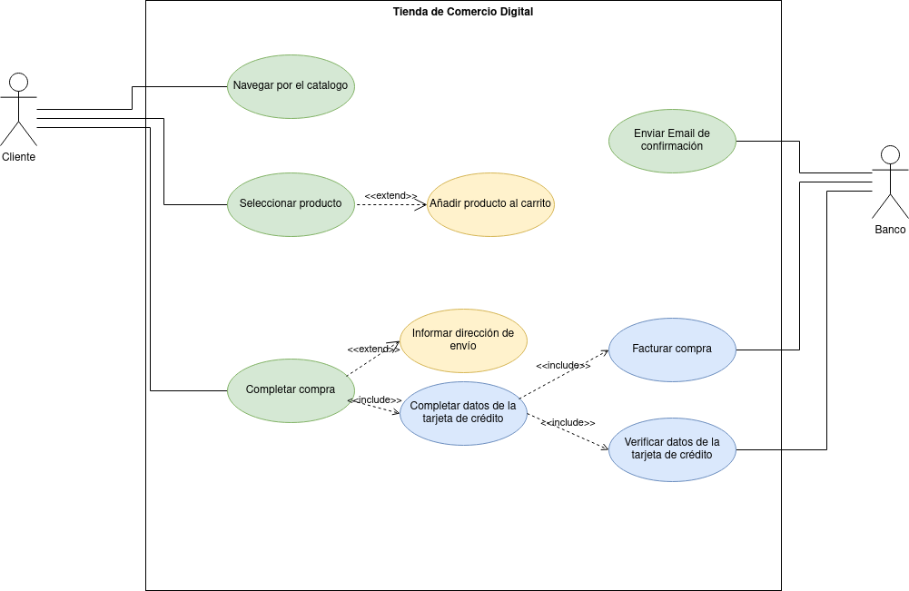

# Examen-teorico-ETS

## Alejandro Salazar González

## Ejercicio 1 Tienda de Comercio Electrónico

Una tienda en línea necesita un sistema que permita a los clientes comprar productos a través de un sitio web.

Como parte de los requisitos funcionales, el sistema debe incluir los siguientes procesos:

1. El cliente puede navegar por el catálogo para visualizar los productos disponibles.
2. Una vez que el cliente selecciona un producto, tiene la opción de colocar el artículo en el carrito.
3. Para completar la compra, el cliente debe realizar las siguientes acciones:
    * Informar su dirección de envío (extensión opcional si ya tiene una dirección registrada).
    * Completar los datos de su tarjeta de crédito para el pago.
4. Durante la transacción, el sistema debe:
    * Verificar los datos de la tarjeta de crédito del cliente.
    * Facturar la compra exitosamente.
    * Enviar un e-mail de confirmación con los detalles de la compra al cliente.

El sistema también debe mostrar qué partes de este flujo son obligatorias y cuáles son opcionales. A partir de los requerimientos indicados:

Diseña un diagrama de casos de uso que represente las interacciones entre el cliente, el sistema y los casos de uso necesariosy los actores implicados para realizar una compra. Usa relaciones como << include >> y << extend >> según corresponda.

## Ejercicio 2: Realiza la especificación de Casos de Uso

Realiza la especificación de casos de uso de la siguiente imagen.

### Actores

|  Actor | Cliente |
|---|---|
| Descripción  | _Usuario del sistema de VIDEOMAX_  |
| Características  | _Registra cliente, Registra alquiler y Registra reserva, dependen involucran al administrador_ |
| Relaciones | __  |
| Referencias | _Proporciona Datos Personalez, Alquila Pelicula, Reserva Pelicula, Devuelve pelicula, Selecciona Pelicula_ |   
|  Notas |  __ |
| Autor  | _Alejandro Salazar González_ |
|Fecha | _18/11/2024_ |

|  Atributo |||
|---|---|---|
| _Nombre_  | _Descripción_  | _Tipo_ |
| | |

|  Actor | Proveedor |
|---|---|
| Descripción  | _Proveedor de peliculas de VIDEOMAX_  |
| Características  | __ |
| Relaciones | __  |
| Referencias | _Abastece Pelicula Segùn Existencia, Abastece Pelicula_ |   
|  Notas |  __ |
| Autor  | _Alejandro Salazar González_ |
|Fecha | _18/11/2024_ |

|  Atributo |||
|---|---|---|
| _Nombre_  | _Descripción_  | _Tipo_ |
| | |

|  Actor | Administrador VIDEOMAX |
|---|---|
| Descripción  | _Administrador del sistema de VIDEOMAX_  |
| Características  | _Los casos de uso  Registra Cliente, Registra Alquiler, Registra Reserva, dependen de que un cliente haga algo_ |
| Relaciones | __  |
| Referencias | _Registra Cliente, Registra Alquiler, Registra Reserva, Registra Pelicula, Actualiza Proveedor_ |   
|  Notas |  __ |
| Autor  | _Alejandro Salazar González_ |
|Fecha | _18/11/2024_ |

|  Atributo |||
|---|---|---|
| _Nombre_  | _Descripción_  | _Tipo_ |
| | |

### Casos de Uso

|  Caso de Uso	CU | Proporcionar informacion personal  |
  |---|---|
  | Fuentes  | _[Documento]()_  |
  | Actor  |  _Cliente_ |
  | Descripción | _El usuario da sus datos personales_  |
  | Flujo básico | __ |
  | Pre-condiciones | __  |  
  | Post-condiciones  | _Se regstra al cliente_  |  
  |  Requerimientos | __  |
  |  Notas |  _Notas adicionales_ |
  | Autor  | _Alejandro Salazar González_ |
  |Fecha | _18/11/2024_ |

|  Caso de Uso	CU | Alquila Pelicula  |
  |---|---|
  | Fuentes  | _[Documento]()_  |
  | Actor  |  _Cliente_ |
  | Descripción | _El usuario alquila una pelicula_  |
  | Flujo básico | __ |
  | Pre-condiciones | _Selecciona una pelicula_  |  
  | Post-condiciones  | _Se regstra el alquiler, devuelve la pelicula_  |  
  |  Requerimientos | _Ser cliente_  |
  |  Notas |  _Notas adicionales_ |
  | Autor  | _Alejandro Salazar González_ |
  |Fecha | _18/11/2024_ |

|  Caso de Uso	CU | Reserva pelicula  |
  |---|---|
  | Fuentes  | _[Documento]()_  |
  | Actor  |  _Cliente_ |
  | Descripción | _El usuario reserva una pelicula_  |
  | Flujo básico | __ |
  | Pre-condiciones | _elige una pelicula_  |  
  | Post-condiciones  | _Se regstra la reserva_  |  
  |  Requerimientos | _Ser Cliente_  |
  |  Notas |  _Notas adicionales_ |
  | Autor  | _Alejandro Salazar González_ |
  |Fecha | _18/11/2024_ |

|  Caso de Uso	CU | Devolver pelicula pelicula  |
  |---|---|
  | Fuentes  | _[Documento]()_  |
  | Actor  |  _Cliente_ |
  | Descripción | _El usuario devuelve una pelicula_  |
  | Flujo básico | _Alquila una pelicula, se devuelve la pelicula_ |
  | Pre-condiciones | _Reservar una pelicula_  |  
  | Post-condiciones  | __  |  
  |  Requerimientos | _ser cliente_  |
  |  Notas |  _Notas adicionales_ |
  | Autor  | _Alejandro Salazar González_ |
  |Fecha | _18/11/2024_ |

|  Caso de Uso	CU | Selecionar pelicula  |
  |---|---|
  | Fuentes  | _[Documento]()_  |
  | Actor  |  _Cliente_ |
  | Descripción | _El usuario elige una pelicula_  |
  | Flujo básico | _Alquila o reserva una pelicula, selecciona la pelicula_ |
  | Pre-condiciones | _Alquilar pelicula, Reservar pelicula_  |  
  | Post-condiciones  | __  |  
  |  Requerimientos | _ser cliente_  |
  |  Notas |  _Notas adicionales_ |
  | Autor  | _Alejandro Salazar González_ |
  |Fecha | _18/11/2024_ |

|  Caso de Uso	CU | Abastece pelicula segun existencia  |
  |---|---|
  | Fuentes  | _[Documento]()_  |
  | Actor  |  _Proveedor_ |
  | Descripción | _Lleva peliculas a la tienda segun la cantidad que tenga_  |
  | Flujo básico | __ |
  | Pre-condiciones | __  |  
  | Post-condiciones  | __  |  
  |  Requerimientos | __  |
  |  Notas |  _Notas adicionales_ |
  | Autor  | _Alejandro Salazar González_ |
  |Fecha | _18/11/2024_ |

|  Caso de Uso	CU | Abastece pelicula  |
  |---|---|
  | Fuentes  | _[Documento]()_  |
  | Actor  |  _Proveedor_ |
  | Descripción | _Lleva peliculas a la tienda_  |
  | Flujo básico | __ |
  | Pre-condiciones | _Hacen falta peliculas en la tienda_  |  
  | Post-condiciones  | __  |  
  |  Requerimientos | __  |
  |  Notas |  _Notas adicionales_ |
  | Autor  | _Alejandro Salazar González_ |
  |Fecha | _18/11/2024_ |

|  Caso de Uso	CU | Abastece pelicula  |
  |---|---|
  | Fuentes  | _[Documento]()_  |
  | Actor  |  _Proveedor_ |
  | Descripción | _Lleva peliculas a la tienda_  |
  | Flujo básico | __ |
  | Pre-condiciones | _Hacen falta peliculas en la tienda_  |  
  | Post-condiciones  | __  |  
  |  Requerimientos | __  |
  |  Notas |  _Notas adicionales_ |
  | Autor  | _Alejandro Salazar González_ |
  |Fecha | _18/11/2024_ |

|  Caso de Uso	CU | Registra Cliente  |
  |---|---|
  | Fuentes  | _[Documento]()_  |
  | Actor  |  _Administrador VIDEOMAX_ |
  | Descripción | _registra los datos de un cliente_  |
  | Flujo básico | _cliente ingresa datos personales, se registra el cliente_ |
  | Pre-condiciones | _Un cliente nuevo tiene que ingresar sus datos_  |  
  | Post-condiciones  | __  |  
  |  Requerimientos | __  |
  |  Notas |  _Notas adicionales_ |
  | Autor  | _Alejandro Salazar González_ |
  |Fecha | _18/11/2024_ |

|  Caso de Uso	CU | Registra Alquiler  |
  |---|---|
  | Fuentes  | _[Documento]()_  |
  | Actor  |  _Administrador VIDEOMAX_ |
  | Descripción | _registra el alquiler de una pelicula_  |
  | Flujo básico | _cliente alquila una pelicula, se registra el alquiler_ |
  | Pre-condiciones | _Un cliente alquila una pelicula_  |  
  | Post-condiciones  | __  |  
  |  Requerimientos | _Un cliente tiene que alquilar una pelicula_  |
  |  Notas |  _Notas adicionales_ |
  | Autor  | _Alejandro Salazar González_ |
  |Fecha | _18/11/2024_ |

|  Caso de Uso	CU | Registra Reserva  |
  |---|---|
  | Fuentes  | _[Documento]()_  |
  | Actor  |  _Administrador VIDEOMAX_ |
  | Descripción | _registra la reserva de una pelicula_  |
  | Flujo básico | _cliente elige una pelicula, reserva la pelicula, se registra la reserva_ |
  | Pre-condiciones | _Un cliente reserva una pelicula_  |  
  | Post-condiciones  | __  |  
  |  Requerimientos | __  |
  |  Notas |  _Notas adicionales_ |
  | Autor  | _Alejandro Salazar González_ |
  |Fecha | _18/11/2024_ |

|  Caso de Uso	CU | Registra Pelicula  |
  |---|---|
  | Fuentes  | _[Documento]()_  |
  | Actor  |  _Administrador VIDEOMAX_ |
  | Descripción | _registra una pelicula_  |
  | Flujo básico | _se abastece pelicula, se registra la pelicula_ |
  | Pre-condiciones | __  |  
  | Post-condiciones  | __  |  
  |  Requerimientos | __  |
  |  Notas |  _Notas adicionales_ |
  | Autor  | _Alejandro Salazar González_ |
  |Fecha | _18/11/2024_ |

|  Caso de Uso	CU | Actualiza proveedor  |
  |---|---|
  | Fuentes  | _[Documento]()_  |
  | Actor  |  _Administrador VIDEOMAX_ |
  | Descripción | _Acualiza el proveedor de peliculas_  |
  | Flujo básico | __ |
  | Pre-condiciones | __  |  
  | Post-condiciones  | __  |  
  |  Requerimientos | __  |
  |  Notas |  _Notas adicionales_ |
  | Autor  | _Alejandro Salazar González_ |
  |Fecha | _18/11/2024_ |